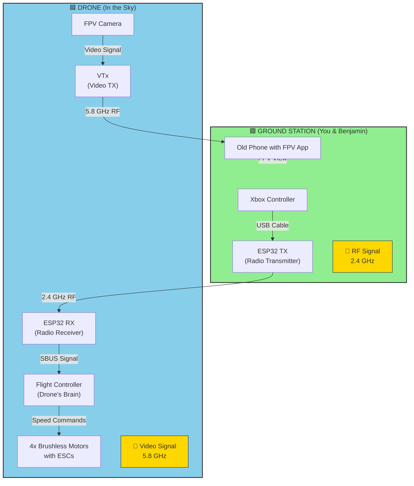
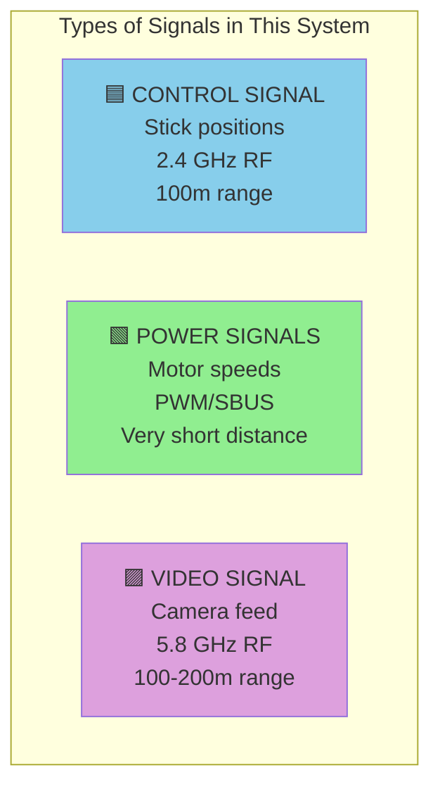
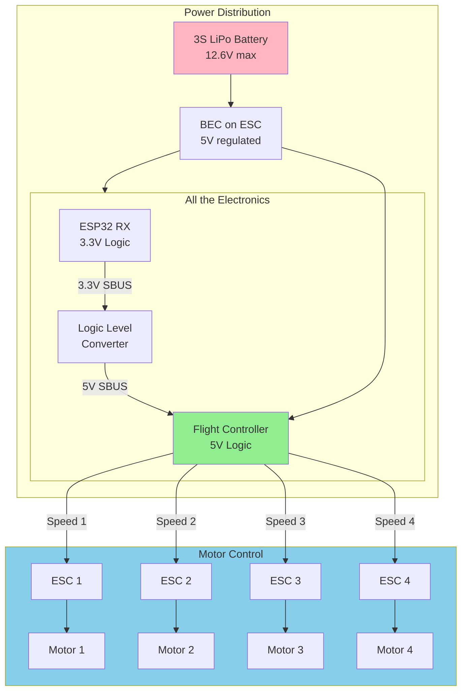
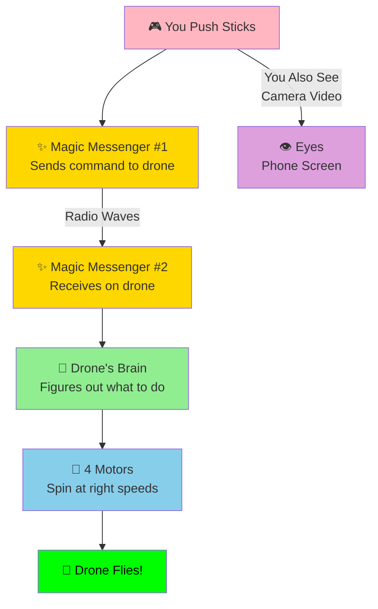

# System Diagram - Mermaid

## High-Level System Diagram

```mermaid
graph TB
    subgraph Ground["🟩 GROUND STATION (You & Benjamin)"]
        Xbox["Xbox Controller"]
        Phone["Old Phone with FPV App"]
        TX["ESP32 TX<br/>(Radio Transmitter)"]
        
        Xbox -->|USB Cable| TX
        RX_Signal["📡 RF Signal<br/>2.4 GHz"]
    end
    
    subgraph Drone["🟦 DRONE (In the Sky)"]
        RX["ESP32 RX<br/>(Radio Receiver)"]
        FC["Flight Controller<br/>(Drone's Brain)"]
        Motors["4x Brushless Motors<br/>with ESCs"]
        Camera["FPV Camera"]
        VTx["VTx<br/>(Video TX)"]
        
        RX -->|SBUS Signal| FC
        FC -->|Speed Commands| Motors
        Camera -->|Video Signal| VTx
        Video_Signal["📡 Video Signal<br/>5.8 GHz"]
    end
    
    TX -->|"2.4 GHz RF"| RX
    VTx -->|"5.8 GHz RF"| Phone
    
    Phone -->|FPV View| Ground
    
    style Ground fill:#90EE90,stroke:#333,stroke-width:2px
    style Drone fill:#87CEEB,stroke:#333,stroke-width:2px
    style RX_Signal fill:#FFD700,stroke:#333,stroke-width:1px
    style Video_Signal fill:#FFD700,stroke:#333,stroke-width:1px
```

## Control Flow Diagram

```mermaid
graph LR
    A["🎮 Benjamin<br/>Pushes Sticks"] 
    B["Xbox Controller<br/>Reads Input"]
    C["ESP32 TX<br/>Converts to RF"]
    D["📡 Radio Waves<br/>2.4 GHz"]
    E["ESP32 RX<br/>on Drone"]
    F["Flight Controller<br/>Reads Commands"]
    G["Motors Spin<br/>at Different Speeds"]
    H["🚁 Drone Moves!"]
    
    A --> B
    B --> C
    C --> D
    D --> E
    E --> F
    F --> G
    G --> H
    
    style A fill:#FFB6C1
    style D fill:#FFD700
    style H fill:#90EE90
```

## Data Signal Types

```mermaid
graph TD
    subgraph Signals["Types of Signals in This System"]
        A["🟦 CONTROL SIGNAL<br/>Stick positions<br/>2.4 GHz RF<br/>100m range"]
        
        B["🟩 POWER SIGNALS<br/>Motor speeds<br/>PWM/SBUS<br/>Very short distance"]
        
        C["🟪 VIDEO SIGNAL<br/>Camera feed<br/>5.8 GHz RF<br/>100-200m range"]
    end
    
    style A fill:#87CEEB
    style B fill:#90EE90
    style C fill:#DDA0DD
```

## Component Connections

```mermaid
graph TB
    subgraph Electronics["All the Electronics"]
        ESP32RX["ESP32 RX<br/>3.3V Logic"]
        FC["Flight Controller<br/>5V Logic"]
        LLC["Logic Level<br/>Converter"]
        
        ESP32RX -->|3.3V SBUS| LLC
        LLC -->|5V SBUS| FC
    end
    
    subgraph Power["Power Distribution"]
        Battery["3S LiPo Battery<br/>12.6V max"]
        BEC["BEC on ESC<br/>5V regulated"]
        
        Battery --> BEC
        BEC --> FC
        BEC --> Electronics
    end
    
    subgraph Motors["Motor Control"]
        FC -->|Speed 1| ESC1["ESC 1"]
        FC -->|Speed 2| ESC2["ESC 2"]
        FC -->|Speed 3| ESC3["ESC 3"]
        FC -->|Speed 4| ESC4["ESC 4"]
        
        ESC1 --> M1["Motor 1"]
        ESC2 --> M2["Motor 2"]
        ESC3 --> M3["Motor 3"]
        ESC4 --> M4["Motor 4"]
    end
    
    style Battery fill:#FFB6C1
    style FC fill:#90EE90
    style Motors fill:#87CEEB
```

## Simplified Benjamin's View

```mermaid
graph TB
    YOU["🎮 You Push Sticks"]
    MAGIC1["✨ Magic Messenger #1<br/>Sends command to drone"]
    MAGIC2["✨ Magic Messenger #2<br/>Receives on drone"]
    BRAIN["🧠 Drone's Brain<br/>Figures out what to do"]
    MUSCLES["💪 4 Motors<br/>Spin at right speeds"]
    FLY["🚁 Drone Flies!"]
    
    YOU --> MAGIC1
    MAGIC1 -->|Radio Waves| MAGIC2
    MAGIC2 --> BRAIN
    BRAIN --> MUSCLES
    MUSCLES --> FLY
    
    YOU -->|"You Also See<br/>Camera Video"| SEE["👁️ Eyes<br/>Phone Screen"]
    
    style YOU fill:#FFB6C1
    style MAGIC1 fill:#FFD700
    style MAGIC2 fill:#FFD700
    style BRAIN fill:#90EE90
    style MUSCLES fill:#87CEEB
    style FLY fill:#00FF00,color:#000
    style SEE fill:#DDA0DD
```

